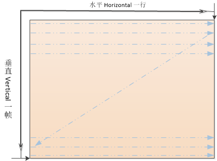

# 一级标题

<<<<<<< HEAD


aaaaaaaaa
=======
debug
>>>>>>> 77ba6c6... oops, add debug
[go to see test dir](./test)

## 二级标题

[这是链接https://www.baidu.com/](https://www.baidu.com/)

正文开始,下面是一些操作命令

	第二行正文,前面应该有一个TAB,这里开始已经在黑框中了

=======
## 二级标题

[这是链接https://www.baidu.com/](https://www.baidu.com/)

正文开始,下面是一些操作命令

	第二行正文,前面应该有一个TAB,这里开始已经在黑框中了

>>>>>>> 19211fc8de4c9b38d7fd4674f16bf53132dbb0c7
		第三行正文,前面应该有一个TAB

		第四行正文,前面应该有一个TAB

	sudo emerge -v dev-python/pip

	ls -la

	python test.py

### 三级标题

正文开始,下面是一些操作命令

	第二行正文,前面应该有一个TAB,这里开始已经在黑框中了

		第三行正文,前面应该有一个TAB

		第四行正文,前面应该有一个TAB

	sudo emerge -v dev-python/pip

	ls -la

	python test.py

## 二级标题

这里都是正文内容

这里都是正文内容

这里都是正文内容

下面是图片


## 下面是无序列条

- 这里都是正文内容

- 这里都是正文内容

- 这里都是正文内容

有如下文本

```xml
	<label abc def="ade">The is what we want</label>
	<label abc def="ade">Why</label>
	<label abc def="ade">Vim</label>
	<label abc def="ade">Is</label>
	<label abc def="ade">So</label>
	<label abc def="ade">Great!</label>
```

在执行了下面命令后

	:%s/^.*>\(.*\)<\/label>/\1/

<<<<<<< HEAD
%s 匹配全部范围

^.*> 匹配开头所有到>

\(.*\) 匹配所有

<\/label> 匹配</label>

\1 在这里是\(.*\)
=======
%s          全部范围

^.*>        开头所有到>

\(.*\)      所有都匹配

<\/label>   匹配</label>

\1          在这里是\(.*\)
>>>>>>> 19211fc8de4c9b38d7fd4674f16bf53132dbb0c7

结果如下

	The is what we want
	Why
	Vim
	Is
	So
	Great!
<<<<<<< HEAD
=======

```sequence

participant A

participant B

participant C as C_Alias

```

[sub1](sub1/README.md)

[sub2](sub2/README.md)
>>>>>>> 19211fc8de4c9b38d7fd4674f16bf53132dbb0c7
gg

